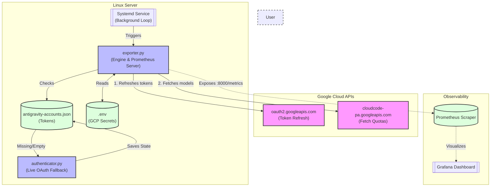

# Antigravity Token Monitoring Dashboard

The Antigravity Token Monitoring Dashboard is an automated Prometheus metrics exporter designed to track and visualize your Google Cloud AI model token utilization (via Antigravity/Cloud Code APIs). 

By extracting live quota remaining fractions and reset times across all available models, this tool ensures you always have observability over your API limits in Grafana.

## Key Features
- **Multi-Account Support**: Automatically loops through multiple authenticated Google accounts to extract quotas simultaneously.
- **Live Authentication Fallback**: Natively hooks into `opencode-antigravity-auth` extensions, but seamlessly triggers a local OAuth browser login if the credentials are missing or expired.
- **Automated Discovery**: Detects every single LLM model available to you (Gemini 2.5, Claude, etc.) and exposes their specific availability and utilization quotas.
- **Systemd Integration**: Runs smoothly as a robust background service on Linux systems.

## Architecture

The project adheres strictly to the **B.L.A.S.T.** protocol and **A.N.T.** 3-layer architecture (Architecture, Navigation, Tools).
- **Architecture**: The deterministic ruleset for token extraction and authentication.
- **Navigation (Engine)**: The exporter script managing state and error loops.
- **Tools**: The atomic endpoints fetching from external APIs.



## Pre-Requisites

Before installing this tool on a Linux machine, ensure you have:
1. **Python 3.8+** and `python3-venv` installed.
2. **Prometheus & Grafana** servers accessible (either locally or remote).
3. A Google Cloud OAuth Client ID and Secret with Desktop application scopes (`openid email profile https://www.googleapis.com/auth/cloud-platform`).

## Installation (Linux)

Follow these steps to deploy the exporter as a background `systemd` service:

### 1. Clone & Configure
Clone the repository and inject your Google credentials into a `.env` file.
```bash
git clone https://github.com/reubenrajan/antigravity-token-monitoring.git
cd antigravity-token-monitoring
cp .env.example .env

# Edit .env with your real GOOGLE_CLIENT_ID and GOOGLE_CLIENT_SECRET
nano .env 
```

### 2. Manual Authentication Run
If you haven't previously authenticated via the Antigravity extension, you must run the exporter manually once. It will spin up the environment and launch a browser window for you to log into Google.
```bash
python3 -m venv .venv
source .venv/bin/activate
pip install -r requirements.txt # (or pip install prometheus-client requests python-dotenv)

python tools/exporter.py
# Follow the prompt to log in via your browser.
# Once it says "Successfully authenticated", you can press Ctrl+C to stop it.
```
*Note: If you run this on a headless server via SSH, you can port-forward `8080` to your local machine to complete the browser flow, or use a desktop environment.*

### 3. Deploy as a Systemd Service
Once your `antigravity-accounts.json` holds a valid refresh token, deploy the script as a reliable background service:
```bash
sudo ./setup.sh
```
This script will:
- Initialize the token configuration if it's somehow missing.
- Generate a `systemd` configuration file tied to your active user account.
- Enable the service to run on boot.
- Start the exporter immediately.

**Verify Status:**
```bash
sudo systemctl status antigravity-metrics-server
```

### 4. Configure Grafana
1. Point your Prometheus scrape config to `localhost:8000` (or the IP of your machine).
2. Open Grafana.
3. Import the exact definitions located at `dashboards/dashboard.json`.
4. Ensure the dashboard's data source is mapped to your new Prometheus feed.
